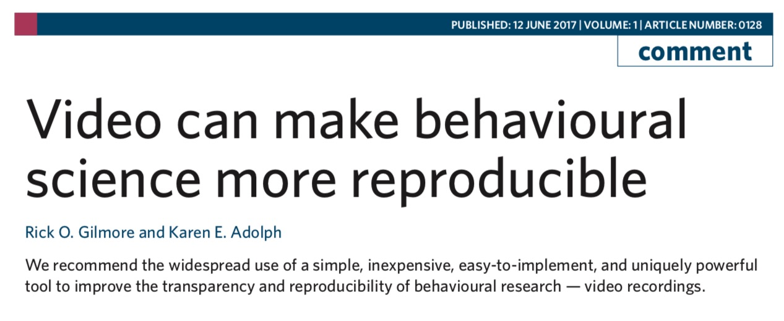
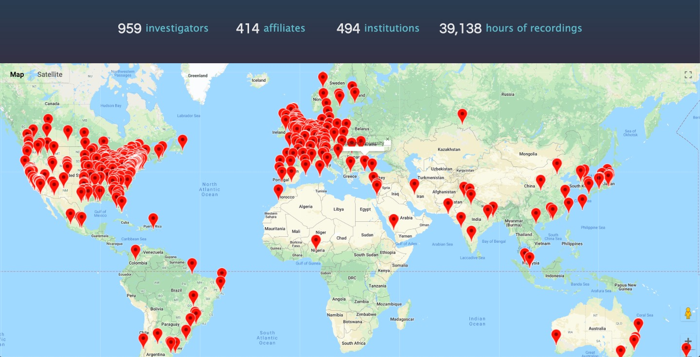

```{r setup, include=FALSE}
knitr::opts_chunk$set(echo = FALSE)
source('R/write_video_clip_html.R')
```

---

<iframe src="https://databrary.org" height=600 width=1000>
</iframe>

# Preliminaries

---


</br>


</br>


<!-- Funding sources with icons -->

## Overview

- Video as data
- Video as documentation
- Sharing ethically & securely with Databrary
- Accelerating discovery

# Video as data

---


<small>
[Adolph, Gilmore, & Kennedy, 2017](https://www.apa.org/science/about/psa/2017/10/video-data)
</small>

<!-- Video as data and documentation -->

---

```{r results='asis'}
write_video_clip_html('https://nyu.databrary.org/slot/9840/-/asset/11192/download?inline=true', 
                      vid_w_pix = 640, vid_h_pix = 480, show_link = FALSE)
```

<small>
[Frank 2014](http://doi.org/10.17910/B7PP4W)
</small>

<!-- Physical abacus -->

---

```{r results='asis'}
write_video_clip_html('https://nyu.databrary.org/slot/9840/-/asset/11193/download?inline=true', 
                      vid_w_pix = 640, vid_h_pix = 480, show_link = FALSE)
```

<small>
[Frank 2014](http://doi.org/10.17910/B7PP4W)
</small>

<!-- Mental abacus -->

---

<iframe src="http://doi.org/10.17910/B7PP4W" height=600 width=1000>
</iframe>

<small>
[Frank 2014](http://doi.org/10.17910/B7PP4W)
</small>

---

<iframe src="http://doi.org/10.17910/B7B885" height=600 width=1000>
</iframe>

<small>
[Demuth 2014](http://doi.org/10.17910/B7B885)
</small>

---

```{r, results='asis'}
write_video_clip_html('https://nyu.databrary.org/slot/6785/3117000,7177732/asset/12753/download?inline=true', 
                      vid_w_pix = 640, vid_h_pix = 480, show_link = FALSE)
```

<small>
[Demuth 2014](http://doi.org/10.17910/B7B885)
</small>

---


<small>
[Demuth 2014](http://doi.org/10.17910/B7B885)
</small>

---


<small>
[Demuth 2014](http://doi.org/10.17910/B7B885)
</small>

---


<small>
[DeLoache, Uttal, & Rosengren 2004](https://10.1126/science.1093567)
</small>

## If a picture is worth 1,000 words...

---

```{r, results='asis'}
write_video_clip_html('https://nyu.databrary.org/slot/9850/-/asset/11556/download?inline=true', 
                      vid_w_pix = 640, vid_h_pix = 480, show_link = FALSE)
```

<small>
[DeLoache 2014](http://doi.org/10.17910/B7H019)
</small>

---

```{r, results='asis'}
write_video_clip_html('https://nyu.databrary.org/slot/9850/-/asset/11550/download?inline=true', 
                      vid_w_pix = 640, vid_h_pix = 480, show_link = FALSE)
```

<small>
[DeLoache 2014](http://doi.org/10.17910/B7H019)
</small>

## A video is worth...

## ...a paper in *Science*

## Video...

- Captures (& preserves)
- Shows (& helps tell...)
- Expands the scope of inquiry
- Provides opportunities for reuse

# Video as documentation

---



<small>
[Gilmore & Adolph, 2017](https://doi.org/10.1038/s41562-017-0128)
</small>


---

```{r results='asis'}
write_video_clip_html("https://nyu.databrary.org/slot/11647/0,84928/asset/40653/download?inline=true", vid_w_pix = 640, vid_h_pix = 480, show_link = FALSE)
```

<small>
[Yu 2016](http://doi.org/10.17910/B7.236)
</small>

---


<small>
[Bahrick, 2017](http://doi.org/10.17910/B7.326)
</small>

---

```{r results='asis'}
write_video_clip_html('https://nyu.databrary.org/slot/16668/0,140984/asset/72645/download?inline=true', show_link = FALSE)
```

---

<iframe src="https://manybabies.github.io/" height=600 width=1000>
</iframe>

---

```{r results='asis'}
write_video_clip_html('https://nyu.databrary.org/slot/27535/0,400466/asset/122312/download?inline=true', vid_w_pix = 640, vid_h_pix = 480, show_link = FALSE)
```
<small>
[Trehub 2017](http://doi.org/10.17910/B7.671)
</small>

## Even audio

---

<iframe src="https://doi.org/10.1126/science.274.5294.1926" width=1000 height=600/>
</iframe>

<small>
[Saffan, Aslin, & Newport 1996](https://doi.org/10.1126/science.274.5294.1926)
</small>

---

<audio controls>
<source src="https://nyu.databrary.org/slot/9801/-/asset/27666/download?inline=true">
</audio>

<small>
[Saffran 2014](http://doi.org/10.17910/B7NP4K)
</small>

---

<iframe src="http://doi.org/10.17910/b7.339" height=500 width=1000>
</iframe>

<small>
[Cole, Gilmore, Perez-Edgar, & Scherf 2017](http://doi.org/10.17910/b7.339)
</small>

---


<audio controls>
<source src="https://nyu.databrary.org/slot/16956/110000,120032/asset/73386/download?inline=true">
</audio>
</br>
<audio controls>
<source src="https://nyu.databrary.org/slot/16956/0,10032/asset/73350/download?inline=true">
</audio>

<small>
[Cole, Gilmore, Perez-Edgar, & Scherf 2017](http://doi.org/10.17910/b7.339)
</small>

## Shared video & audio recordings

---

- Make research more transparent
- Bolster the reproducibility of procedures
- Accelerate the adoption of new research techniques
- Strengthen findings
- Maximize public investments in research

# Sharing video ethically & openly

## Video must be protected

---

- Faces, voices
- Home interiors
- Behaviors that may embarrass participants

## Open sharing advances discovery

---

- Citation expected, but 
- No requirement for co-authorship
- No pre-approval of research questions

## Databrary

- Requires researchers secure participant permission to share
- Requires IRB/ethics board approval to share (but not to browse or show for non-research purposes)
- Restricts access to authorized researchers

## Permission to share

- Standard language via [templates](https://www.databrary.org/resources/templates.html)
- When to ask & how decided by local ethics boards/IRBs
- Sample [scripts](https://www.databrary.org/resources/guide/investigators/release/asking/script.html) and [videos](https://www.databrary.org/resources/guide/investigators/release/asking/examples.html)

---

```{r results='asis'}
write_video_clip_html('https://www.databrary.org/video/example-video-1.mp4', vid_h_pix = 600, vid_w_pix = 800, show_link = FALSE)
```

## Restricting access

- Researchers at institutions
- Formalized by an [institutional agreement](https://www.databrary.org/resources/agreement.html)
- Protects participants, researchers, & institutions

## Standardized [levels of sharing](https://www.databrary.org/resources/guide/investigators/release/release-levels.html)

---


---



# Accelerating discovery

## Need

- Annotation tools
- More (bigger, denser, diverse) data
- Platforms for discovery

---

<video src="mov/databrary-splash.mp4" autoplay loop/>
</video>

---

<iframe src="https://datavyu.org" height=600 width=1000>
</iframe>

---

```{r results='asis'}
write_video_clip_html("https://nyu.databrary.org/slot/27087/0,372193/asset/119877/download?inline=true", vid_w_pix = 800, vid_h_pix = 600, show_link = FALSE)
```
<small>
[Adolph, Tamis-LeMonda, & Gilmore 2017](https://nyu.databrary.org/volume/444#panel-data)
</small>

---

- $n=900$ infant/mother dyads, $n=300$ 12-, 18-, and 24-month-olds
- Demographics, health status, media use, temperament
- Modified MB-CDI
- Open protocol, video documentation

---

<iframe src="https://play-behaviorome.github.io/PLAY-project.org/" height=600 width=1000>
</iframe>

## Platforms for discovery

# Next steps...

## Register for Databrary access

## Download and test the [*databraryapi*] package

## Secure permission to share from research participants

## Collect, upload, & share video and audio recordings

# Thank you

---


---

rogilmore@psu.edu</br>

<https://gilmore-lab.github.io/2019-06-MacWhinney-Symposium/databrary-workshop/>

