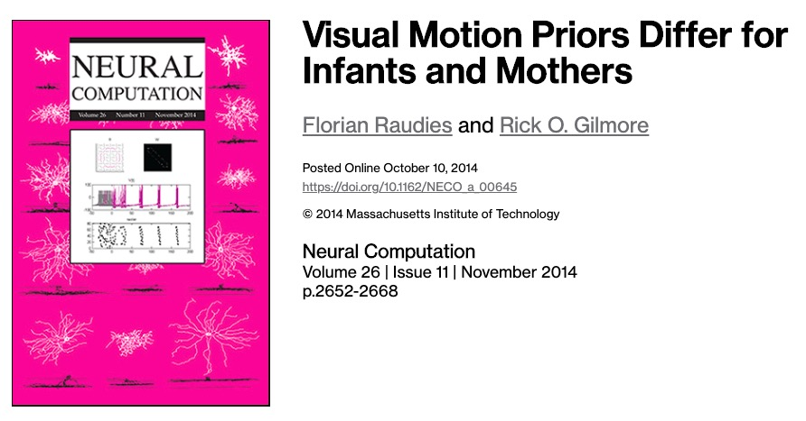
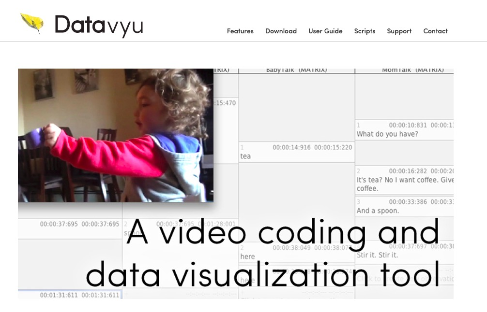

```{r setup, include=FALSE}
knitr::opts_chunk$set(echo = FALSE, cache=TRUE)

source('../databrary-workshop/R/write_video_clip_html.R')

knitr::opts_chunk$set(echo = FALSE)

library(tidyverse)
library(ggplot2)

if (!require(qrcode)) {
  install.packages('qrcode')
}
library(qrcode)

# Log-in to Databrary
logged_in <- databraryapi::login_db(params$db_login)
```

---

```{r qr-code, echo=FALSE, warning=FALSE, message=FALSE}
talk_url <- 'https://gilmore-lab.github.io/2019-06-MacWhinney-Symposium/datatribute-to-brian/'
qrcode::qrcode_gen(talk_url)
```

---


<!-- Goats with bells on -->

# Preliminaries

---


</br>


</br>


<!-- Funding sources with icons -->

---


</br>


<!-- Photo montage of ROG background -->

## Overview

- The hardest science
- Open by design
- Inspired by Brian

# The hardest science

## Psychology is the hardest science

<div class="notes">
I claim that psychology is the hardest science.
</div>

## (Harder than physics)

<div class="notes">
Harder than physics.
I suspect most of the people in this room agree, but in case there are skeptics, let me try to convince you in two simple figures.
</div>

---


<div class="notes">
First year physical science students often face problems like this. Given a mass M, an inclined plane with specified geometry, and a gravitational field, we can predict the future with high precision. What's going to happen next?

Yes, but if we change one element in this equation, the problem becomes immensely harder. What if we change the mass to a mouse?
</div>

---


<!-- What happens now? We don't know. -->

## Why is it so hard?

---


<!-- Perhaps less widely appreciated, the phenomena we study have a nested structure. -->

<div class="notes">
Relatedly, but perhaps less widely appreciated, the phenomena we study have a complex nested structure.

I designed this logo for my lab group to remind me of it.

The science of the mind and behavior collects and integrates evidence from at least four logically separable but mutually embedded realms.
</div>

---

- Body ($B$) within world ($W$)
- Nervous system ($N$) within body ($B$)
- Mind ($M$) within nervous system ($N$)

<div class="notes">

Our bodies are embedded in a world.
Our nervous systems with our bodies.
And our mind within the nervous system.
</div>

---

$\dot{M} = f_{M}(M,N)$

$\dot{N} = f_{N}(N,B)$

$\dot{B} = f_B(B,N,W)$

$\dot{W} = f_W(W,B)$

<div class="notes">
And using the mathematical language of dynamical systems, we can say that these realms are mutually coupled to one another: Changes in the mind are a function of mental and nervous system states, and so forth...

And make no mistake: The mind, brain, and body are non-linear dynamical systems, whether or not we study them that way.

Dynamical systems involve rule-based changes in state variables.
</div>

---

```{r, echo=FALSE, message=FALSE, warning=FALSE}
el <- rbind(c("W","B"), c("B","N"), c("N","M"), c("M","N"), c("N","B"), c("B", "W"))
g <- igraph::graph_from_edgelist(el)
g$layout <- igraph::layout_in_circle
plot(g, vertex.size=80, vertex.color="gray", edge.color = "blue")
```

<div class="notes">
The reality is that responses affect the world, responses and world states evoke stimuli, stimuli affects cognition, cognition affects responses, and the cycle repeats.

Non-linear, closed-loop dynamical systems like this require broader and denser data about all of the realms in order to reveal the underlying processes.
Data that can be difficult or expensive to collect.

But even in situations when the data are available, when all of these states are well-known, our current methods have some striking limitations.
</div>

---

<a href="">

</a>

<small>
[Sejnowski, Churchland, & Movshon, 2014](http://doi.org/10.1038/nn.3839)
</small>

<div class="notes">
</div>

---

<p><a href="https://commons.wikimedia.org/wiki/File:Pieter_Bruegel_the_Elder_-_The_Tower_of_Babel_(Vienna)_-_Google_Art_Project.jpg#/media/File:Pieter_Bruegel_the_Elder_-_The_Tower_of_Babel_(Vienna)_-_Google_Art_Project.jpg"></a>
</p>

<!-- And like the builders of the Tower of Babel after suffering God's wrath, we often struggle to communicate with one another about essential ideas. -->

<div class="notes">
This painting of the Tower of Babel should remind all of us often we're  like the builders after suffering God's wrath: Too often we struggle to communicate with one another about essential concepts and ideas from our distinct subfields.

For example, William James may have said that 'everyone knows what attention is', but I'm not sure we agree.
</div>

---


<!-- The whole elephant -->

<div class="notes">
This figure depicts the classic Hindu myth of the blind men examining an elephant. 
To me, it also reflects the state of psychological science.

We're all studying the elephant, or so we say, but we might easily mistake the trunk for a spear, or the tail for a rope, and so forth.

I want to see the whole elephant!
Don't you?
</div>

## What do to about it?

## Follow a leader

# Open by design

## The language sciences are far ahead of many fields in addressing the problems required to understand language behavior

## Theory is important...

---


Noam Chomsky

<div class="notes">
Or the cognitive critique of behaviorism articulated most effectively by Noam Chomsky.
</div>

## But data are fundamental

---

- Can children acquire language from the environment?
- Or do they require rich, prior, innate knowledge about the structure of language?

---

- What is the child's language environment ($W$)?
- How does $W$ shape changes in behavior $\dot{B}$
- and by extension, the brain $N$, and the mind $M$?

---

<iframe src="https://talkbank.org/" height=600 width=1000>
</iframe>

---


---

<video height="320" data-autoplay>
  <source src="https://nyu.databrary.org/slot/7739/0,26134/asset/16749/download?inline=true" type="video/mp4">
Your browser does not support the video tag.
</video>

<video height="320" data-autoplay>
  <source src="https://nyu.databrary.org/slot/7739/0,26634/asset/16747/download?inline=true" type="video/mp4">
Your browser does not support the video tag.
</video>

<small>
[Gilmore, Raudies, Franchak, & Adolph, 2015](http://doi.org/10.17910/B7.116)
</small>

---




---

>"*One of the most fundamental questions in psychology concerns the role of experience. What are the essential components of human experience?*"

<small>
[The Homeview Project - Smith et al.](http://www.indiana.edu/~cogdev/homeview.html)
</small>

---


- 500+ hours of head camera video
- 91 infants (46 female, 45 male) 1-24 mos (US)
- 40 (24 female, 16 male) 1 to 15 (India)

---

```{r, results='asis', echo=FALSE}
write_video_clip_html("https://nyu.databrary.org/slot/11636/8167736,8217311/asset/40375/download?inline=true", show_link = FALSE)
```

<small>
[Jayaraman, Smith, Raudies, & Gilmore, 2014](http://doi.org/10.17910/B7988V)
</small>

## Data must be openly shared

---

>"*Why would I share my data? No one else would want to see it.*"

A random colleague

---

>"*It's too much work to share.*"

Another random colleague

---

>"*I don't want someone to scoop me or do an analysis I plan to do someday.*"

More random colleagues than you might imagine

---

<iframe src="https://talkbank.org/share/principles.html" height=600 width=1000>
</iframe>

<small>
<https://talkbank.org/share/principles.html>
</small>

---

>"*Principles of scientific integrity require that ideas be put to a test. In order to test your ideas about your data, you need to open them up to others who will either support or challenge your ideas.*"

<small>
<https://talkbank.org/share/principles.html>
</small>

---

>"*Some types of claims can only be tested against large data sets or against comparisons of somewhat similar data sets. To make these analyses, we often need more and more data.*"

<small>
<https://talkbank.org/share/principles.html>
</small>

---

>"*Much of the work in science is conducted using public funds. We have an obligation to the public to make maximally efficient use of these data.*"

<small>
<https://talkbank.org/share/principles.html>
</small>

---


Russ Poldrack, founder of [OpenNeuro](https://openneuro.org/), [The Cognitive Atlas](https://www.cognitiveatlas.org/)

---

>"*...the principles of human subject research require an analysis of both risks and benefits...*"

<small>
[Brakewood & Poldack, 2013](http://dx.doi.org/10.1016/j.neuroimage.2013.02.040)
</small>

---

>"*...such an analysis suggests that researchers may have a positive duty to share data in order to maximize the contribution that individual participants have made.*"

<small>
[Brakewood & Poldack, 2013](http://dx.doi.org/10.1016/j.neuroimage.2013.02.040)
</small>

## Robert Merton


---


---

- **universalism**: scientific validity is independent of sociopolitical status/personal attributes of its participants
- **communalism**: common ownership of scientific goods (intellectual property)

---

- **disinterestedness**: scientific institutions benefit a common scientific enterprise, not specific individuals
- **organized skepticism**: claims should be exposed to critical scrutiny before being accepted

---


<small>
Walter Mischel
</small>

---


---

> "*...psychologists tend to treat other peoples’ theories like toothbrushes; no self-respecting individual wants to use anyone else’s.*"

<small>
[Mischel, 2009](https://www.psychologicalscience.org/observer/becoming-a-cumulative-science)
</small>

---

> "*The toothbrush culture undermines the building of a genuinely cumulative science, encouraging more parallel play and solo game playing, rather than building on each other’s directly relevant best work.*"

<small>
[Mischel, 2009](https://www.psychologicalscience.org/observer/becoming-a-cumulative-science)
</small>

## Data must be organized and shared in common formats

---

```
12    @Date:	21-JAN-2003
13    *MOT:	alright , sit over here . 
14    %mor:	co|alright cm|cm v|sit prep|over pro:dem|here .
15    %gra:	1|3|COM 2|1|LP 3|0|ROOT 4|3|JCT 5|4|POBJ 6|3|PUNCT
16    *MOT:	sit near me and I'll help you build it . 
17    %mor:	v|sit prep|near pro:obj|me conj|and pro:sub|I~mod|will v|help
18    	pro|you v|build pro|it .
19    %gra:	1|0|ROOT 2|1|JCT 3|2|POBJ 4|7|LINK 5|7|SUBJ 6|7|AUX 7|1|CJCT 8|9|SUBJ
```  

---

- extensions for CA, PhonBank, etc...

---

<iframe width="888" height="500" src="https://www.youtube.com/embed/66oNv_DJuPc" frameborder="0" allow="accelerometer; data-autoplay; encrypted-media; gyroscope; picture-in-picture" allowfullscreen>
</iframe>

<!-- <https://www.youtube.com/embed/66oNv_DJuPc> -->

---


<small>
[Wilkinson et al., 2016](http://dx.doi.org/10.1038/sdata.2016.18)
</small>

---

Data should be...

- **F**indable
- **A**ccessible
- **I**nteroperable
- **R**eusable

## Blessed are the toolmakers

---

- tool-building is invaluable
- tool-building represents a high-impact contribution to scholarship

---

<iframe src="http://dali.talkbank.org/clan/" height=600 width=1000>
</iframe>

---


## Data + tools can energize research communities

---

<iframe src="http://childes-db.stanford.edu/" width=1000 height=600>
</iframe>

<small>
<http://childes-db.stanford.edu/>
</small>

---

<!-- <iframe src="https://sla.talkbank.org/TalkBankDB/" width=1000 height=600> -->
<!-- </iframe> -->


<small>
<https://sla.talkbank.org/TalkBankDB/>
</small>

---

- child language
- aphasia, dementia, ASD, RHD, TBI
- bi/multilingualism
- phonology, syntax, semantics, behavior
- audio, video, transcripts

## Behavior in its natural contexts and in its full complexity can be studied productively

# Inspired by Brian

---

<video width="800" data-autoplay>
  <source src="https://github.com/gilmore-lab/DEVSEC-2018/blob/master/mov/databrary-splash.mp4?raw=true" type="video/mp4">
  </video>
  
---

- Share video, audio, \*.cha, \*.csv, etc.
- Access restricted to institutionally authorized researchers
- Citation required, but not pre-approval of research questions

## Video...

- Captures (& preserves)
- Shows (& helps tell...)
- Expands the scope of inquiry (e.g., words +)
- Provides unparalleled opportunities for reuse

<div class="notes">
Video captures and preserves aspects of behavior that other measures often neglect; it shows what participants do and helps tell the story; it expands the scope of inquiry to include other behaviors; and it provides unparalleled opportunities for reuse.

Video also has unique strengths as research documentation.
</div>

---

```{r databrary-growth-plot, echo=TRUE}
databraryapi::read_csv_data_as_df() %>%
  ggplot(.) +
  aes(Auth_Investigators, Institutions) +
  geom_point()
```

<small>
<https://github.com/PLAY-behaviorome/databraryapi>

<https://github.com/PLAY-behaviorome/databrarypi>
</small>

---



---

```{r, results='asis', echo=FALSE}
write_video_clip_html("http://datavyu.org/user-guide/_static/video/coding-example.mp4", vid_w_pix = 800, vid_h_pix = 600, show_link = FALSE)
```

<small>
<http://datavyu.org/user-guide/walkthrough-videos.html>
</small>

---

<iframe src="http://datavyu.org/user-guide/best-practices.html" height=600 width=1000/>

<small>
<http://datavyu.org/user-guide/best-practices.html>
</small>

---

- scriptable
- optimized for efficient coding of **ANY** behavior
- convertible to/from CHAT

## Play & Learning Across a Year (PLAY) project

- What do mothers and infants actually *DO*

---

```{r, results='asis', echo=FALSE}
write_video_clip_html("https://nyu.databrary.org/slot/27087/0,372193/asset/119877/download?inline=true", vid_w_pix = 800, vid_h_pix = 600, show_link = FALSE)
```

<small>
[Adolph, Tamis-LeMonda, & Gilmore 2017](https://nyu.databrary.org/volume/444#panel-data)
</small>

<div class="notes">
We're also creating a large-scale, diverse and rich data set for others to exploit via the Play & Learning Across a Year (PLAY) Project.
</div>

---

- ~$n=1,000$ infant/mother dyads, $n=300$ 12-, 18-, and 24-month-olds
- Demographics, health status, media use, temperament
- Modified MB-CDI (interview, video-recorded, English/Spanish item-level equivalents)
- Open protocol, video documentation

---


<!-- The whole elephant -->

---

<p><a href="https://commons.wikimedia.org/wiki/File:Pieter_Bruegel_the_Elder_-_The_Tower_of_Babel_(Vienna)_-_Google_Art_Project.jpg#/media/File:Pieter_Bruegel_the_Elder_-_The_Tower_of_Babel_(Vienna)_-_Google_Art_Project.jpg"></a>
</p>

## Brian says:

---

- Ontologies are essential

## Karen, Cathie, & Rick say:

---

>- You're right, Brian. (Of course)
>- We just don't know what they should be.

---

<iframe src="https://play-project.org/" height=600 width=1000>
</iframe>

## Why not BehaviorBank or WalkBank or ...?

- Following your (collective) lead
- Putting all the pieces together
- Speech + gesture + emotion + locomotion + object interaction + ...

---

<div class="centered">


# ...before it was cool

---


<!-- Open science word cloud -->

---


## Thank you, Brian!

---

<video width="800" data-autoplay>
  <source src="https://github.com/gilmore-lab/DEVSEC-2018/blob/master/mov/databrary-splash.mp4?raw=true" type="video/mp4">
</video>

<small>
rogilmore@psu.edu</br>
<https://gilmore-lab.github.io></br>
<https://gilmore-lab.github.io/2019-06-MacWhinney-Symposium/databrary-workshop/tribute-to-brian/></br>
[\@rogilmore](https://twitter.com/rogilmore)
</small>

---

<small>
This talk was produced on `r Sys.Date()` in [RStudio](http://rstudio.com) version using R Markdown and the reveal.JS framework.
The code and materials used to generate the slides may be found at <https://github.com/gilmore-lab/2019-06-MacWhinney-Symposium/tribute-to-brian/>.
Information about the R Session that produced the code is as follows:

---

```{r session-info}
sessionInfo()
```
</small>
