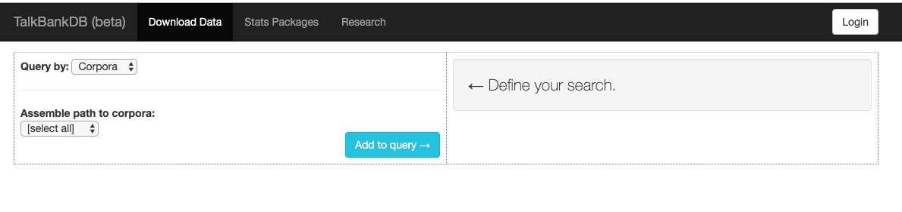

```{r setup, include=FALSE}
knitr::opts_chunk$set(echo = FALSE, cache=TRUE)

source('../databrary-workshop/R/write_video_clip_html.R')

knitr::opts_chunk$set(echo = FALSE)

library(tidyverse)
library(ggplot2)

if (!require(qrcode)) {
  install.packages('qrcode')
}
library(qrcode)

# Log-in to Databrary
logged_in <- databraryapi::login_db(params$db_login)
```

---

```{r qr-code, echo=FALSE, warning=FALSE, message=FALSE}
talk_url <- 'https://gilmore-lab.github.io/2019-06-MacWhinney-Symposium/datatribute-to-brian/'
qrcode::qrcode_gen(talk_url)
```

# Preliminaries

---


</br>


</br>


<!-- Funding sources with icons -->

---


</br>


<!-- Photo montage of ROG background -->

## Overview

- The hardest science
- Open by design
- Inspired by this open science pioneer

# The hardest science

## Psychology is the hardest science

<div class="notes">
I claim that psychology is the hardest science.
</div>

## (Harder than physics)

<div class="notes">
Harder than physics.
I suspect most of the people in this room agree, but in case there are skeptics, let me try to convince you in two simple figures.
</div>

---


<!-- First year physical science students often face problems like this. Given a mass M, an inclined plane with specified geometry, and a gravitational field, we can predict the future with high precision. What's going to happen next? -->

<!-- Yes, but if we change one element in this equation, the problem becomes immensely harder. What if we change the mass to a mouse? -->

<div class="notes">
First year physical science students often face problems like this. Given a mass M, an inclined plane with specified geometry, and a gravitational field, we can predict the future with high precision. What's going to happen next?

Yes, but if we change one element in this equation, the problem becomes immensely harder. What if we change the mass to a mouse?
</div>

---


<!-- What happens now? We don't know. -->

# Open by design

## Data are fundamental

---


Noam Chomsky

<div class="notes">
Or the cognitive critique of behaviorism articulated most effectively by Noam Chomsky.
</div>

---

- Can children acquire language from the environment?
- Or do they require rich, prior, innate knowledge about the structure of language?

---

- What is the child's language environment?

---

<iframe src="https://talkbank.org/" height=600 width=1000>
</iframe>

---


---


---

<video height="320" data-autoplay>
  <source src="https://nyu.databrary.org/slot/7739/0,26134/asset/16749/download?inline=true" type="video/mp4">
Your browser does not support the video tag.
</video>

<video height="320" data-autoplay>
  <source src="https://nyu.databrary.org/slot/7739/0,26634/asset/16747/download?inline=true" type="video/mp4">
Your browser does not support the video tag.
</video>

<small>
[Gilmore, Raudies, Franchak, & Adolph, 2015](http://doi.org/10.17910/B7.116)
</small>

---

>"*One of the most fundamental questions in psychology concerns the role of experience. What are the essential components of human experience?*"

<small>
[The Homeview Project - Smith et al.](http://www.indiana.edu/~cogdev/homeview.html)
</small>

## Data must be openly shared

---

>"*Why would I share my data? No one would want to see it.*"

A random colleague

---

>"*It's too much work to share.*"

Another random colleague

---

>"*I don't want someone to scoop me or do an analysis I plan to do someday.*"

More random colleagues than you might imagine

---

<iframe src="https://talkbank.org/share/principles.html" height=600 width=1000>
</iframe>

<small>
<https://talkbank.org/share/principles.html>
</small>

---

>"*Principles of scientific integrity require that ideas be put to a test. In order to test your ideas about your data, you need to open them up to others who will either support or challenge your ideas.*"

<small>
<https://talkbank.org/share/principles.html>
</small>

---

>"*Some types of claims can only be tested against large data sets or against comparisons of somewhat similar data sets. To make these analyses, we often need more and more data.*"

<small>
<https://talkbank.org/share/principles.html>
</small>

---

>"*Much of the work in science is conducted using public funds. We have an obligation to the public to make maximally efficient use of these data. For example, the NIH has now issued guidelines on this issue.*"

<small>
<https://talkbank.org/share/principles.html>
</small>

---


Russ Poldrack, founder of [OpenNeuro](https://openneuro.org/), [The Cognitive Atlas](https://www.cognitiveatlas.org/)

---

>"*...the principles of human subject research require an analysis of both risks and benefits...*"

<small>
[Brakewood & Poldack, 2013](http://dx.doi.org/10.1016/j.neuroimage.2013.02.040)
</small>

---

>"*...such an analysis suggests that researchers may have a positive duty to share data in order to maximize the contribution that individual participants have made.*"

<small>
[Brakewood & Poldack, 2013](http://dx.doi.org/10.1016/j.neuroimage.2013.02.040)
</small>

## Robert Merton


---


---

- **universalism**: scientific validity is independent of sociopolitical status/personal attributes of its participants
- **communalism**: common ownership of scientific goods (intellectual property)

---

- **disinterestedness**: scientific institutions benefit a common scientific enterprise, not specific individuals
- **organized skepticism**: claims should be exposed to critical scrutiny before being accepted

---


<small>
Walter Mischel
</small>

---


---

> "*...psychologists tend to treat other peoples’ theories like toothbrushes; no self-respecting individual wants to use anyone else’s.*"
<small>
[Mischel, 2009](https://www.psychologicalscience.org/observer/becoming-a-cumulative-science)
</small>

---

> "*The toothbrush culture undermines the building of a genuinely cumulative science, encouraging more parallel play and solo game playing, rather than building on each other’s directly relevant best work.*"

<small>
[Mischel, 2009](https://www.psychologicalscience.org/observer/becoming-a-cumulative-science)
</small>

## Data must be organized and shared in common formats

---

- CHAT, extensions for CA, PhonBank, etc...

---

<iframe width="888" height="500" src="https://www.youtube.com/embed/66oNv_DJuPc" frameborder="0" allow="accelerometer; data-autoplay; encrypted-media; gyroscope; picture-in-picture" allowfullscreen>
</iframe>

<!-- <https://www.youtube.com/embed/66oNv_DJuPc> -->

---


<small>
[Wilkinson et al., 2016](http://dx.doi.org/10.1038/sdata.2016.18)
</small>

---

Data should be...

- **F**indable
- **A**ccessible
- **I**nteroperable
- **R**eusable

## Discovery requires powerful tools

## (and tool-building represents an invaluable, important, and high-impace scholarly contribution)

---

<iframe src="http://dali.talkbank.org/clan/" height=600 width=1000>
</iframe>

---


## Data + tools can energize and help build research communities

---

<iframe src="http://childes-db.stanford.edu/" width=1000 height=600>
</iframe>

<small>
<http://childes-db.stanford.edu/>
</small>

---

<!-- <iframe src="https://sla.talkbank.org/TalkBankDB/" width=1000 height=600> -->
<!-- </iframe> -->


<small>
<https://sla.talkbank.org/TalkBankDB/>
</small>

---

- child language
- aphasia, dementia, ASD, RHD, TBI
- bi/multilingualism
- phonology, syntax, semantics, behavior
- audio, video, transcripts

# Inspirations

---

<video width="800" data-autoplay>
  <source src="https://github.com/gilmore-lab/DEVSEC-2018/blob/master/mov/databrary-splash.mp4?raw=true" type="video/mp4">
  </video>

---

- Share video, audio, *.cha, .csv, etc.
- Access restricted to institutionally authorized researchers
- Citation required, but no pre-approval of research questions

---


---

```{r, results='asis', echo=FALSE}
write_video_clip_html("http://datavyu.org/user-guide/_static/video/coding-example.mp4", vid_w_pix = 800, vid_h_pix = 600, show_link = FALSE)
```

<small>
<http://datavyu.org/user-guide/walkthrough-videos.html>
</small>

---

<iframe src="http://datavyu.org/user-guide/best-practices.html" height=600 width=1000/>

<small>
<http://datavyu.org/user-guide/best-practices.html>
</small>

## Play & Learning Across a Year (PLAY) project

- What do mothers and infants actually *DO*

---

```{r, results='asis', echo=FALSE}
write_video_clip_html("https://nyu.databrary.org/slot/27087/0,372193/asset/119877/download?inline=true", vid_w_pix = 800, vid_h_pix = 600, show_link = FALSE)
```

<small>
[Adolph, Tamis-LeMonda, & Gilmore 2017](https://nyu.databrary.org/volume/444#panel-data)
</small>

<div class="notes">
We're also creating a large-scale, diverse and rich data set for others to exploit via the Play & Learning Across a Year (PLAY) Project.
</div>

---

- $n=900$ infant/mother dyads, $n=300$ 12-, 18-, and 24-month-olds
- Demographics, health status, media use, temperament
- Modified MB-CDI (interview, video-recorded, English/Spanish item-level equivalents)
- Open protocol, video documentation

---

<iframe src="https://play-project.org/" height=600 width=1000>
</iframe>

---

```{r databrary-growth-plot, echo=TRUE}
databraryapi::read_csv_data_as_df() %>%
  ggplot(.) +
  aes(Auth_Investigators, Institutions) +
  geom_point()
```

<http://github.com/PLAY-behaviorome/databraryapi>

---


---

<video width="800" data-autoplay>
  <source src="https://github.com/gilmore-lab/DEVSEC-2018/blob/master/mov/databrary-splash.mp4?raw=true" type="video/mp4">
</video>

<small>
rogilmore@psu.edu</br>
<https://gilmore-lab.github.io></br>
<https://gilmore-lab.github.io/2019-06-MacWhinney-Symposium/databrary-workshop/tribute-to-brian/></br>
[\@rogilmore](https://twitter.com/rogilmore)
</small>

---

<small>
This talk was produced on `r Sys.Date()` in [RStudio](http://rstudio.com) version using R Markdown and the reveal.JS framework.
The code and materials used to generate the slides may be found at <https://github.com/gilmore-lab/2019-06-MacWhinney-Symposium/tribute-to-brian/>.
Information about the R Session that produced the code is as follows:

---

```{r session-info}
sessionInfo()
```
</small>
